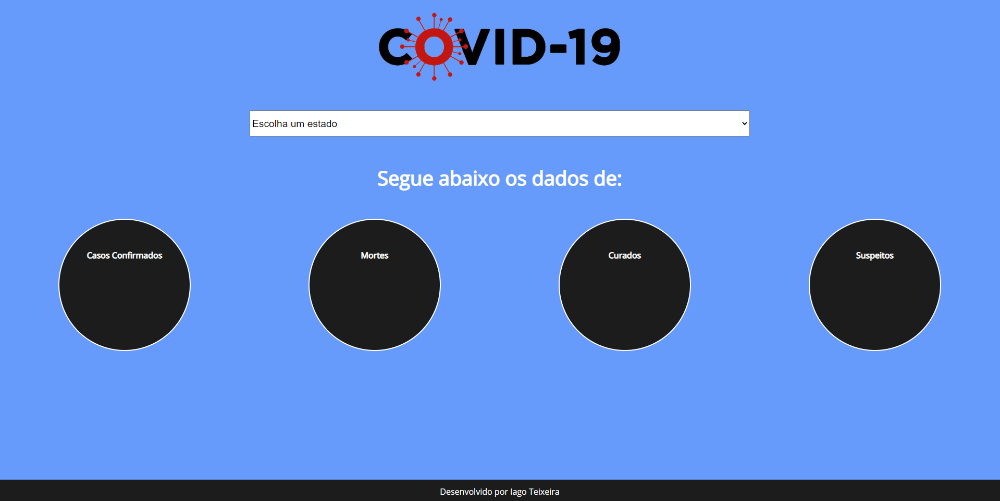

<h1 align="center">
    
</h1>


<h3 align="center">
    
</h3>

<br>

# Índice

- [Sobre](#-sobre)
- [Como Executar o Projeto](#-como-baixar-o-projeto)

---

## 🔖 Sobre

O projeto **Estados BR Covid-19** é um projeto que foi desenvolvido para mostrar casos confirmados, mortes, curados e suspeitos diários.

---

## 📦 Como Executar o Projeto

```bash

    # Instalação de dependências para executar o projeto.
    npm install

    # Executa o serve que foi definido no package.json.
    npm run serve

    # Executa um build específico definido no package.json.
    npm run build

    # Executa o lint e realiza possíveis reparos de arquivos.
    npm run lint

```

---

<h3 align="center">Desenvolvido por Iago Teixeira</h3>